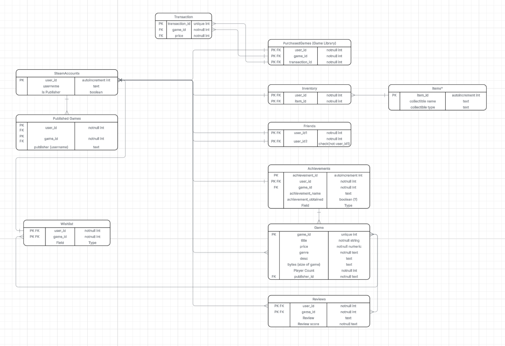

# CS360 Steam Database

A mock Steam-style database created to practice SQL and relational database design. The database models a digital game storefront where users can browse and purchase games, access their game libraries, manage friends and collectible inventories, track achievements and wishlists, and leave reviews. Publisher accounts can also list games on the storefront.

## Team

**The Steam Team**

- Renzo Basurco
- Liyen Liu
- Brandon Villalba
- Cole Prince
- Jestyn Lytle

## Design Document

Project requirements, user roles, and use cases are documented in the [Team 1 Steam Project Design Document](https://docs.google.com/document/d/1e-SKDTFM1wEAM3jELyB8TvaiYgmB_7AGcdglIC59jto/edit?tab=t.k9q6q0u4gu00).

## Entity-Relationship Diagram

## Database Running/Setup Instructions with DB Browser
[DB Browser for SQLite](https://sqlitebrowser.org/)

- Download Steam_DB.db from our repository
- Open DB Browser for SQLite.exe
- In the "File" dropdown menu at the top left, select "Open Database"
- Find the Steam_DB.db file and open it with DB Browser
